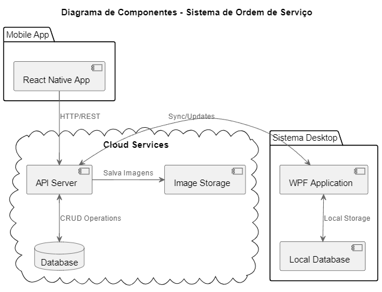
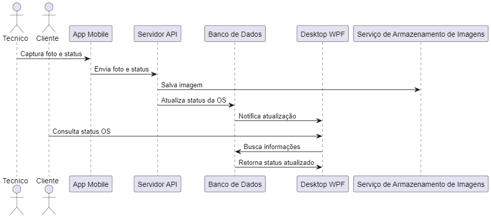

# Sistema de Ordem de Serviço para Assistência Técnica

Sistema completo para gerenciamento de ordens de serviço em assistências técnicas de celulares, composto por uma aplicação desktop (WPF) e um aplicativo mobile (React Native).

## 📱 Visão Geral

O sistema permite gerenciar todo o fluxo de trabalho de uma assistência técnica, desde o recebimento do aparelho até a entrega ao cliente, incluindo:
- Gestão de ordens de serviço
- Controle financeiro
- Gestão de estoque
- Registro fotográfico via app
- Comunicação com clientes

## 🏗 Arquitetura

O sistema é composto por:
- **Aplicação Desktop (WPF)**: Sistema principal de gerenciamento
- **Aplicativo Mobile (React Native)**: Para registro de fotos e atualizações em campo
- **API Server**: Integração entre o app mobile e o sistema desktop
- **Banco de Dados**: Armazenamento centralizado
- **Serviço de Armazenamento**: Para fotos e documentos

### Fluxo de Atualização de Status

O diagrama acima ilustra o fluxo de atualização de status de uma Ordem de Serviço:
1. O técnico captura fotos e atualiza o status via aplicativo mobile
2. O app envia os dados para a API
3. A API salva as imagens no serviço de armazenamento
4. O status é atualizado no banco de dados
5. O sistema desktop é notificado das alterações
6. O cliente pode consultar o novo status através do sistema desktop

### Fluxo de Dados do Sistema

Este diagrama demonstra a interação entre os diferentes componentes do sistema:
- Comunicação entre o app mobile e a API
- Integração com o serviço de armazenamento de imagens
- Sincronização de dados com o sistema desktop
- Fluxo de consultas e atualizações no banco de dados

## 🛠 Funcionalidades Principais

### Sistema Desktop
- Cadastro de clientes e aparelhos
- Gestão de ordens de serviço
- Controle de estoque de peças
- Gestão financeira
- Geração de relatórios
- Impressão de OS e recibos

### Aplicativo Mobile
- Registro fotográfico dos aparelhos
- Atualização de status das OS
- Consulta de estoque
- Chat interno com a loja
- Leitura de QR Code das OS

### Gestão Financeira
- Controle de custos por serviço
- Gestão de compra de peças
- Cálculo de lucro por OS
- Relatórios financeiros
- Controle de pagamentos

## 🔧 Tecnologias Utilizadas

### Desktop (WPF)
- C# (.NET 6+)
- WPF (XAML)
- Entity Framework Core
- ASP.NET Minimal API
- iTextSharp/QuestPDF

### Mobile (React Native)
- React Native
- Expo
- Axios
- React Navigation
- React Native Camera

### Banco de Dados
- MySQL/SQLite
- Entity Framework Core

## 📋 Status do Projeto

- [x] Definição da arquitetura
- [x] Diagramas de sistema
- [ ] Implementação do sistema desktop
- [ ] Implementação do aplicativo mobile
- [ ] Testes integrados
- [ ] Documentação completa

## 📄 Licença

Este projeto está sob a licença [MIT](LICENSE).
